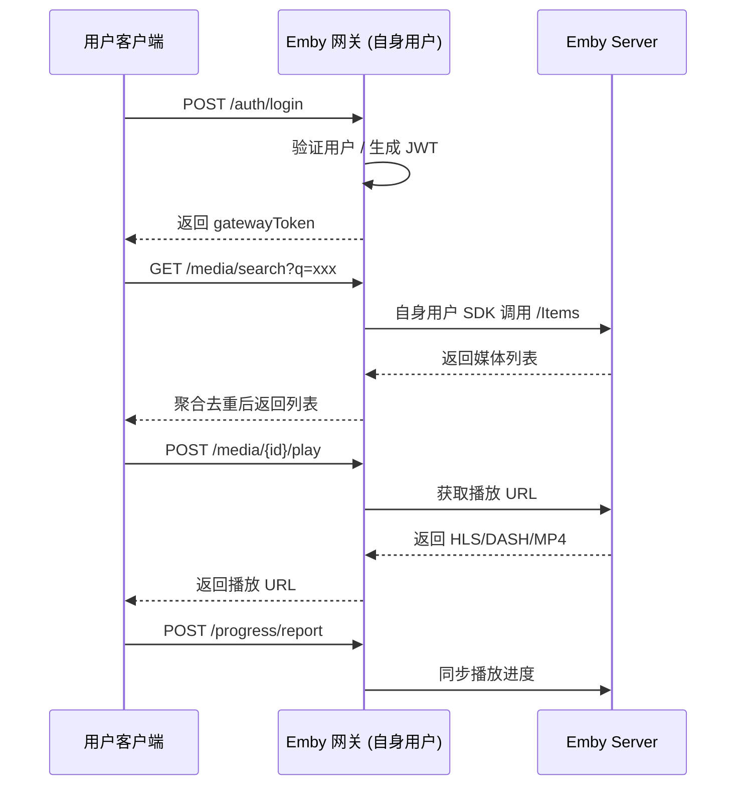

# Emby 网关系统架构文档（V2 完整版）

## 1. 项目定位

**核心定位**：
> **网关 = Emby API 的统一代理 + 网关自身用户管理**

特点：

- 网关本身作为一个 **特殊用户**，登录所有 Emby 服务器  
- 网关代理前端用户请求，调用官方 Emby API（SDK / REST）  
- 对请求进行聚合、去重、路由、播放 URL 生成、进度同步  
- 独立管理客户端用户（JWT / 会话 / 权限）  
- 前端完全不直接访问 Emby Server  

> 网关本质就是一个“Emby API 的桥梁 + 网关用户管理系统”

---

## 2. 技术栈

### 前端
- Angular 15+  
- RxJS、Angular Material、SCSS  

### 后端
- Go 1.21+  
- Gin、GORM、JWT  
- Emby Go SDK / REST API  

### 数据库
- SQLite（单机）  
- PostgreSQL / MySQL（生产）  

### 部署
- Docker / Docker Compose  
- Kubernetes  
- 二进制部署  

---

## 3. 系统初始化流程

### 3.1 管理员初始化

1. 网关启动 → 读取配置  
2. 管理员登录网关 → 获取 JWT  
3. 添加 Emby Server  
   - 配置地址、服务器账号、密码  
   - 网关作为“特殊用户”登录服务器 → 获取 AccessToken  
4. 添加客户端用户 → 独立管理用户信息  

### 3.2 客户端使用流程

```
客户端用户
    │
    ▼
POST /auth/login (网关)
    │ 返回网关 JWT
    ▼
GET /media/search?q=xxx
    │
    ▼
网关使用自身用户 SDK 调用各 Emby Server /Items
    │ 聚合去重
    ▼
返回统一媒体列表
    │
POST /media/{id}/play
    │
    ▼
网关选择最佳服务器
    │ 调用 /Playbacks/Start
    ▼
返回 HLS/DASH/MP4 URL
    │
POST /progress/report
    │
    ▼
网关使用自身用户调用 /Sessions/Playing/Progress 同步进度
```

---

## 4. 核心模块

| 模块 | 功能 |
|------|------|
| **用户管理** | 客户端用户认证、JWT、会话管理 |
| **Gateway User** | 网关自身用户，登录 Emby Server，统一代理请求 |
| **Server Registry** | 管理服务器信息、Token、在线状态 |
| **Media Aggregator** | 调用 SDK / API → 聚合、去重 → 返回前端 |
| **Playback Router** | 选择最优服务器 → 获取播放 URL → 返回 |
| **Progress Broadcaster** | 同步播放进度到各服务器 |
| **Cache / RateLimit** | 提升性能、避免高并发冲击服务器 |
| **Logging / Tracing** | API 链路追踪、错误追踪、审计日志 |

---

## 5. 核心数据流程

### 5.1 媒体搜索

```
客户端用户 → 网关
    │
    ▼
网关 (自身用户) SDK 调用各服务器 /Items
    │
    ▼
聚合去重
    │
    ▼
返回客户端
```

### 5.2 播放

```
客户端用户 → /media/{id}/play
    │
    ▼
网关查询服务器
    │
    ▼
选择最佳服务器
    │ 调用 /Playbacks/Start
    ▼
返回 HLS/DASH/MP4 URL
```

### 5.3 播放进度同步

```
客户端 → /progress/report
    │
    ▼
网关使用自身用户调用 /Sessions/Playing/Progress 同步到各服务器
```

---

## 6. 官方 API / SDK 参考

- Swagger: [https://swagger.emby.media/?staticview=true#/](https://swagger.emby.media/?staticview=true#/)  
- REST API: [https://dev.emby.media/reference/RestAPI.html](https://dev.emby.media/reference/RestAPI.html)  
- Go SDK: [https://github.com/MediaBrowser/Emby.SDK](https://github.com/MediaBrowser/Emby.SDK)  

**网关核心就是调用这些官方接口**，无需自行实现播放逻辑。

---

## 7. Go SDK 核心示例

### 7.1 网关自身用户登录

```go
func loginGatewayToServer(server *Server) error {
    user, err := server.Client.Users.AuthenticateByName(server.Username, server.Password, "", "")
    if err != nil {
        server.IsOnline = false
        return err
    }
    server.Token = user.AccessToken
    server.IsOnline = true
    return nil
}
```

### 7.2 媒体搜索

```go
func searchAllServers(query string) []*emby.BaseItemDto {
    var allItems []*emby.BaseItemDto
    for _, server := range servers {
        if !server.IsOnline { continue }
        items, _ := server.Client.Items.GetItems(&emby.ItemsQuery{SearchTerm: query})
        allItems = append(allItems, items.Items...)
    }
    return mergeMedia(allItems)
}
```

### 7.3 播放 URL 获取

```go
func getPlaybackURL(gatewayItemID, userID string) (string, string) {
    for _, server := range servers {
        if !server.IsOnline { continue }
        stream, _ := server.Client.Playback.GetPlaySession(gatewayItemID, userID, "HLS")
        return server.ID, stream.MediaSource.Path
    }
    return "", ""
}
```

### 7.4 播放进度同步

```go
func broadcastProgress(gatewayItemID, userID string, positionTicks int64, isPaused, isFinished bool) {
    for _, server := range servers {
        if !server.IsOnline { continue }
        _ = server.Client.Sessions.UpdateProgress(gatewayItemID, userID, positionTicks, isPaused, isFinished)
    }
}
```

---

## 8. 数据库设计

### servers

```json
{
  "id": "A",
  "name": "Emby-Server-A",
  "url": "http://192.168.3.171:8096",
  "username": "gateway_user",
  "password": "abc123",
  "isOnline": true,
  "lastSync": "2025-12-16T01:00:00Z"
}
```

### media_index

```json
{
  "gatewayItemId": "G123",
  "tmdbId": "TM123",
  "imdbId": "IM123",
  "name": "Movie Title",
  "year": 2023,
  "serverItems": [
    { "serverId": "A", "itemId": "123" }
  ]
}
```

### users（客户端用户）

```json
{
  "userId": "U001",
  "username": "user1",
  "passwordHash": "...",
  "role": "user",
  "createdAt": "2025-12-16T01:00:00Z"
}
```

---

## 9. 部署架构

- 单机 SQLite / 集群 PostgreSQL 或 MySQL  
- Docker / Kubernetes / 二进制  
- 健康检查 `/health` `/ready`  
- 水平扩展，负载均衡  
- 日志 & 监控，Prometheus metrics  

---

## 10. 系统时序图



---

## 11. 总结

- **网关 = Emby API 代理 + 网关自身用户 + 客户端用户管理**  
- 前端仅持有网关 JWT，无需接触真实 Emby Server  
- 使用官方 SDK / API 完成搜索、播放、进度同步等功能  
- 可水平扩展、支持多服务器、多客户端、多数据库  
- 完全透明、统一、安全

